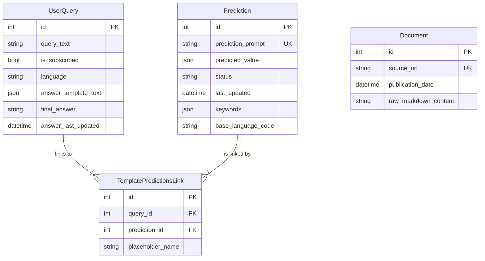
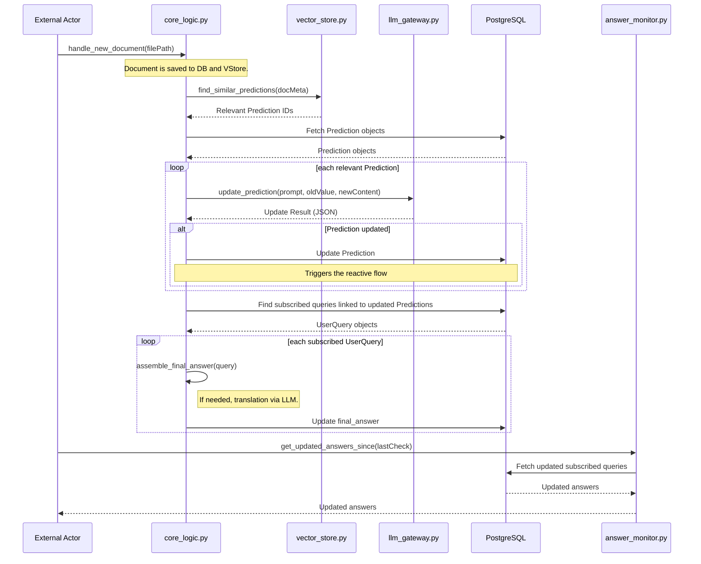

## Architecture and Design Details

This document explains the core design decisions and architectural principles behind the system.

### 1\. Core Philosophy: Proactive RAG

Traditional RAG (Retrieval-Augmented Generation) systems are static; when the database is updated, old answers remain incorrect. **Proactive RAG** is designed to solve this problem. When a new document is added to the system:

1.  The content of this new document is semantically compared against all existing **active `Prediction`** (information extraction tasks).
2.  If a meaningful overlap is found, the relevant `Prediction` task is re-run with the new information, and its result is updated.
3.  The final answers of all **subscribed** user queries connected to this `Prediction` are also automatically regenerated.

This approach allows the system to "heal" itself over time and always stay current.

### 2\. Cost Optimization: Smart Prediction Reuse

One of the system's most innovative aspects is its smart reuse of existing `Prediction` tasks to reduce cost and latency.

**Flow:**

1.  When a new user query arrives, the system first creates a semantic vector of the query.
2.  Using this vector, it finds the most semantically similar existing tasks in the `predictions` collection of ChromaDB.
3.  These "candidate" tasks are presented to the main LLM (e.g., GPT-4) along with the user query.
4.  The LLM acts as a "system architect" and decides: "Can I reuse one of the existing candidates to answer this new query, or should I create a completely new `Prediction` task?"
5.  This proactive check prevents the repeated creation and execution of semantically identical tasks, **significantly reducing costs and latency**.

### 3\. Data Processing Strategy

The system uses **meaningfully rich metadata** rather than the document content itself for RAG and update detection:

  * **Metadata-Centric Vectorization**: When a document is added, metadata such as its `summary` and `keywords` are vectorized and added to ChromaDB.
  * **Context Provisioning**: When context is needed for a `Prediction` task, the most relevant documents are found via these metadata vectors, and the **full content** of these documents is provided to the LLM.

### 4\. Database Architecture and Schema

The system is built on two core databases: **PostgreSQL** for structured data and **ChromaDB** for semantic vector data.

#### PostgreSQL: Relational Data Store

#### ChromaDB: Vector Data Store

  * **`documents` Collection**: Stores the semantic vectors of document metadata (summary, keywords).
  * **`predictions` Collection**: Stores the vectors of `Prediction` prompts and their keywords.

### 5\. Prediction Lifecycle and State Management

A `Prediction` object has a lifecycle managed by the `status` field.

  * **`FULFILLED`**: The task has been executed, has a result, and is available for reuse and reactive updates.
  * **`PENDING`**: The task has been defined but not yet executed.
  * **`INACTIVE`**: The task is no longer used by any active query.

### 6\. Query Subscription Model and Proactive Notifications 🔔

At the heart of the system's proactive capabilities is the **query subscription model**.

  * **Subscription Status**: Every `UserQuery` record contains an `is_subscribed` boolean field, which defaults to `True`.
  * **Controlled Updates**: When a `Prediction` is updated, the system recalculates the `final_answer` field for **only those `UserQuery` records where `is_subscribed = True`**.
  * **Efficiency and Flexibility**: This model allows a user or the system to unsubscribe from a query that no longer requires live updates (using the `update_user_query_subscription` function).
  * **Notification Mechanism**: The `src/answer_monitor.py` module is designed to integrate directly with this model. An external service can periodically poll for updated and **subscribed** answers since a specific time using the `get_updated_answers_since` function.

#### Sequence Diagram of the Subscription Flow

The following diagram illustrates how a subscribed query is proactively updated when a new document arrives.

### 7\. Supported User Query Types

#### Factual Queries 📖

  * **Example:** `"What is zoning right transfer?"`

#### Inferential Queries 🧠

  * **Example:** `"Compare the advantages of zoning right transfer versus classic expropriation."`

#### Procedural Queries 📋

  * **Example:** `"What are the steps in the application process for zoning right transfer?"`

### 8\. End-to-End Simulation (`run_full_test.py`)

The test script demonstrates the system's operation step-by-step: reset, data ingestion, initial query, reactive update test, and validation. This simulation proves how subscribed queries are automatically updated with new information.