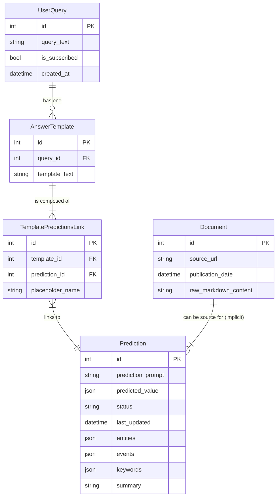

## Mimari ve Tasarım Detayları

Bu doküman, sistemin arkasındaki temel tasarım kararlarını ve mimari prensipleri açıklar.

### 1\. Çekirdek Felsefe: Proactive RAG

Geleneksel RAG sistemleri statiktir; veritabanı güncellendiğinde eski cevaplar yanlış kalmaya devam eder. **Proactive RAG**, bu sorunu çözmek için tasarlanmıştır. Sisteme yeni bir doküman eklendiğinde, bu dokümanın içeriği, mevcut tüm **aktif** Prediction görevleriyle anlamsal olarak karşılaştırılır. Eğer bir eşleşme bulunursa, o Prediction görevi yeni bilgiyle yeniden çalıştırılır ve sonucu güncellenir. Bu, sistemin zamanla kendi kendini "iyileştirmesini" ve güncel kalmasını sağlar.

-----

### 2\. Maliyet Optimizasyonu: Akıllı Prediction Yeniden Kullanımı

Sistemin en yenilikçi yönlerinden biri, Prediction görevlerini tekrar kullanma şeklidir.

**Akış:**

1.  Bir kullanıcı sorgusu geldiğinde, sistem veritabanında "kör" bir arama yapmaz.
2.  Önce, sorgunun anlamsal vektörünü oluşturur ve bunu ChromaDB'deki `predictions` koleksiyonunda aratarak anlamsal olarak en benzer mevcut görevleri bulur.
3.  Bu "aday" görevler, yalnızca **`FULFILLED` (aktif)** durumundakiler arasından seçilir. Bu, sistemin eski veya alakasız görevleri dikkate almasını engeller.
4.  Bu adaylar, ana LLM'e (GPT-4) kullanıcı sorgusuyla birlikte sunulur.
5.  LLM, bir "düşünür" rolü üstlenir: "Bu yeni sorguyu cevaplamak için bu aktif adaylardan birini kullanabilir miyim, yoksa tamamen yeni bir görev mi oluşturmalıyım?"
6.  Bu proaktif kontrol, anlamsal olarak aynı olan görevlerin tekrar tekrar oluşturulmasını ve çalıştırılmasını engelleyerek **maliyetleri ve gecikmeyi önemli ölçüde azaltır**.
    Yeni oluşturulan her Prediction da gelecekteki aramalar için `predictions` vektör koleksiyonuna eklenir, böylece sistem sürekli olarak öğrenir.

-----

### 3\. Veri İşleme: Bağlam Bütünlüğü Stratejisi

Anlamsal aramanın kalitesi, vektör veritabanına eklenen "chunk"ların (parçacıkların) kalitesine bağlıdır. Bağlamın kaybolmasını önlemek için hibrit bir strateji izlenir:

  * **Bağlam Zenginleştirme:** Her bir doküman parçacığının (chunk) başına, ait olduğu dokümanın `title` ve `summary` gibi meta verileri eklenir. Bu, her chunk'ın kendi başına daha anlamlı olmasını sağlar.
  * **Chunk Overlap (Parça Kesişimi):** Metin, langchain'in `RecursiveCharacterTextSplitter`'ı kullanılarak, parçalar arasında bir miktar metin ortak kalacak şekilde bölünür. Bu, bir cümlenin veya fikrin iki chunk arasında bölünerek anlamını yitirmesini engeller.

-----

### 4\. Veritabanı Mimarisi ve Şeması

Sistem, yapısal veriler için **PostgreSQL** ve anlamsal vektör verileri için **ChromaDB** olmak üzere iki temel veritabanı üzerine kuruludur. Bu hibrit yaklaşım, hem ilişkisel veri bütünlüğünü hem de yüksek performanslı anlamsal aramayı mümkün kılar.

#### PostgreSQL: İlişkisel Veri Deposu

Uygulamanın çekirdek nesneleri, durumları ve ilişkileri burada yönetilir.

-----

#### ChromaDB: Vektör Veri Deposu

Anlamsal arama ve benzerlik tespiti için kullanılır. İki ana koleksiyondan oluşur:

  * **`documents` Koleksiyonu**: Doküman meta verilerinin (özet, anahtar kelimeler, varlıklar) anlamsal vektörlerini barındırır. Bir `Prediction` için ilgili bağlamı bulmak (RAG) amacıyla kullanılır.
  * **`predictions` Koleksiyonu**: `Prediction` prompt'larının ve meta verilerinin vektörlerini içerir. Yeni bir sorgu geldiğinde yeniden kullanılabilecek görevleri bulmak amacıyla kullanılır.

-----

### 5\. Prediction Yaşam Döngüsü ve Durum Yönetimi

Bir `Prediction` objesi, sistemde açıkça tanımlanmış bir yaşam döngüsüne sahiptir. Bu döngü, `status` alanı ile yönetilir ve sistemin verimli çalışmasını sağlar.

  * **`PENDING` (Beklemede):** Görev tanımlandı ancak henüz çalıştırılmadı.
  * **`FULFILLED` (Tamamlandı/Aktif):** Görev çalıştırıldı, bir sonuca sahip ve yeniden kullanıma ve reaktif güncellemelere açık.
  * **`INACTIVE` (Pasif):** Görev artık aktif bir sorgu tarafından kullanılmıyor ve "emekliye ayrıldı". Güncellenmez veya yeniden kullanılmaz.

-----

### 6\. Desteklenen Kullanıcı Sorgu Tipleri

Sistemin yetenekleri, sabit bir komut listesiyle değil, kendisine yüklenen dokümanların içeriğiyle belirlenir. Kullanıcıların yöneltebileceği sorguları, amaçlarına ve gerektirdikleri akıl yürütme seviyesine göre şu şekilde sınıflandırabiliriz:

#### Olgusal Sorgular (Factual Queries) 📖

Dokümanlarda var olan gerçek bilgileri çıkarmayı hedefler.

  * **Doğrudan Veri Çıkarımı:** Net, tekil bir bilgiyi bulur.
      * `"Yasa değişikliği hangi tarihte yasalaştı?"`
  * **Tanımlayıcı Sorgular:** Bir kavramın ne olduğunu açıklar.
      * `"Reaktif RAG ne demektir?"`
  * **Özetleyici Sorgular:** Uzun bir metnin ana fikirlerini yoğunlaştırır.
      * `"Yeni kanun teklifinin ana maddelerini özetle."`

#### Çıkarımsal Sorgular (Inferential Queries) 🧠

Farklı bilgi parçacıklarını birleştirerek mantıksal bir çıkarım veya sentez yapılmasını gerektirir.

  * **İlişkisel Akıl Yürütme:** Olaylar arasında neden-sonuç ilişkisi kurar.
      * `"Yeni vergi düzenlemesinin şirketin kâr marjı üzerindeki etkisi ne oldu?"`
  * **Karşılaştırmalı Analiz:** İki veya daha fazla unsuru kıyaslar.
      * `"İmar hakkı aktarımı ile klasik kamulaştırma arasındaki avantaj ve dezavantajları karşılaştır."`
  * **Çok Adımlı Sorgular (Multi-Hop):** Cevap için birden fazla bilginin bulunup birleştirilmesini gerektirir.
      * `"Pazarlama departmanının başındaki yöneticinin daha önce yönettiği en başarılı projenin adı neydi?"`

#### Prosedürel Sorgular (Procedural Queries) 📋

Bir işin veya sürecin "nasıl yapılacağını" adım adım öğrenmeyi amaçlar.

  * `"İmar hakkı aktarımı için başvuru süreci hangi adımları içerir?"`
  * `"Bir şirkette iç denetim raporu nasıl hazırlanır?"`

#### Hipotetik Sorgular (Hypothetical Queries) ❌

Varsayımsal senaryoları sorgular. Sistem, bir simülatör olmadığı için bu tür soruları cevaplayamaz; sadece dokümanlardaki gerçekleri raporlar.

  * `"Eğer yasa teklifi meclisten geçmeseydi ne olurdu?"`
  * `"Şirket, Y projesine hiç başlamasaydı bugünkü finansal durumu nasıl olurdu?"`

-----

### 7\. Uçtan Uca Simülasyon

Bu bölüm, sistemin nasıl çalıştığını adım adım gösterir.

1.  **Kurulum:** `docker-compose up -d` ile veritabanını başlatın ve `python scripts/reset_database.py` ile sıfırlayın.
2.  **Veri Yükleme:** `python scripts/ingest_folder.py` ile sisteme bilgi içeren dokümanları yükleyin.
3.  **İlk Sorgu:** `python scripts/query.py query --text "..."` ile bir soru sorun. Sistem, yeniden kullanılacak görev bulamaz, yeni `Prediction`'lar oluşturur, bunları RAG ile doldurur ve cevabı sentezler.
4.  **Benzer Sorgu:** Anlamsal olarak benzer ikinci bir soru sorun. Sistem bu kez mevcut `Prediction`'ları yeniden kullanarak (`reuse`) çok daha hızlı ve az maliyetli bir cevap üretir.
5.  **Reaktif Güncelleme:** Sisteme mevcut bilgiyi değiştiren yeni bir doküman yükleyin. Sistem, bu yeni bilginin hangi `Prediction`'ları etkilediğini tespit eder, onları otomatik olarak yeniden çalıştırır ve böylece o `Prediction`'lara bağlı tüm eski sorguların cevaplarını proaktif olarak günceller.