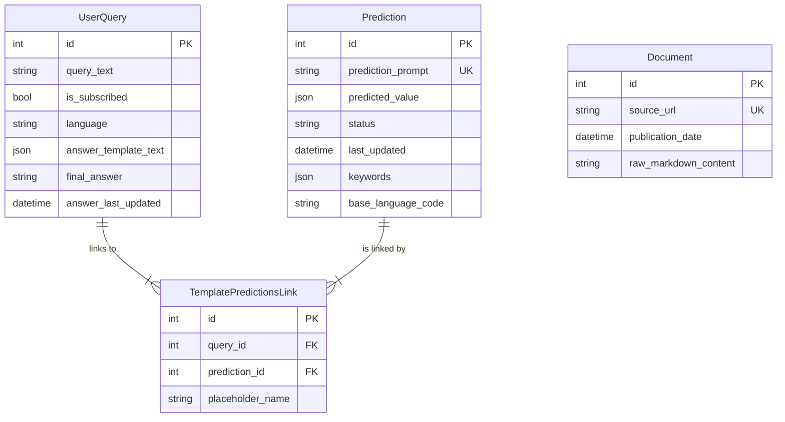
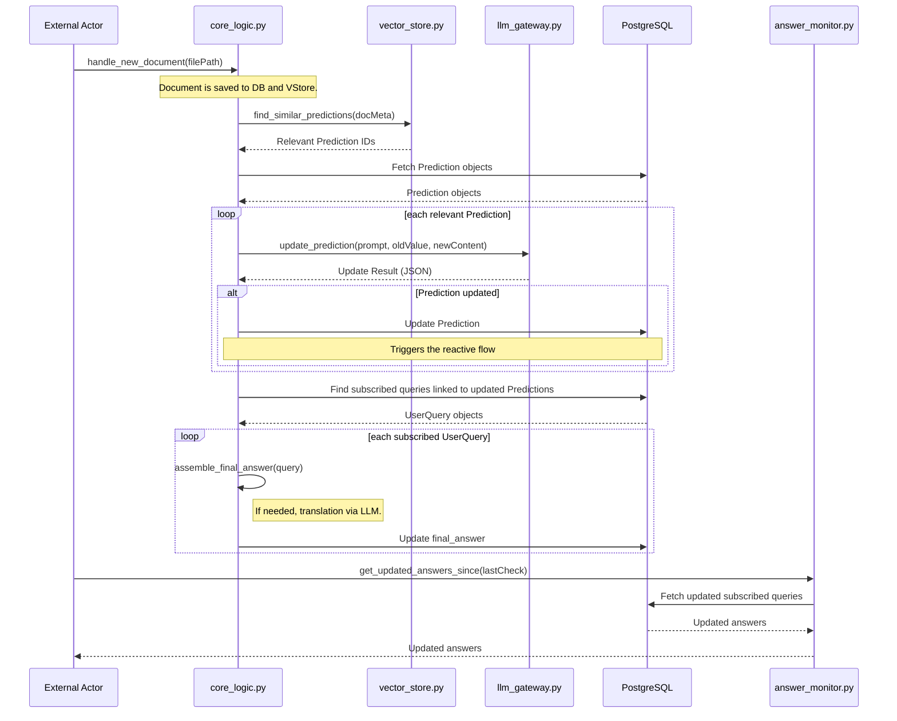

## Mimari ve Tasarım Detayları

Bu doküman, sistemin arkasındaki temel tasarım kararlarını ve mimari prensipleri açıklar.

### 1\. Çekirdek Felsefe: Proaktif RAG

Geleneksel RAG (Retrieval-Augmented Generation) sistemleri statiktir; veri tabanı güncellendiğinde eski cevaplar yanlış kalmaya devam eder. **Proaktif RAG**, bu sorunu çözmek için tasarlanmıştır. Sisteme yeni bir doküman eklendiğinde:

1.  Bu yeni dokümanın içeriği, mevcut tüm **aktif `Prediction`** (bilgi çıkarma görevleri) ile anlamsal olarak karşılaştırılır.
2.  Eğer anlamlı bir örtüşme bulunursa, ilgili `Prediction` görevi yeni bilgiyle yeniden çalıştırılır ve sonucu güncellenir.
3.  Bu `Prediction`'a bağlı olan tüm **abone olunmuş (`subscribed`)** kullanıcı sorgularının nihai cevapları da otomatik olarak yeniden oluşturulur.

Bu yaklaşım, sistemin zamanla kendi kendini "iyileştirmesini" ve her zaman güncel kalmasını sağlar.

### 2\. Maliyet Optimizasyonu: Akıllı Prediction Yeniden Kullanımı

Sistemin en yenilikçi yönlerinden biri, maliyet ve gecikmeyi azaltmak için mevcut `Prediction` görevlerini akıllıca yeniden kullanmasıdır.

**Akış:**

1.  Yeni bir kullanıcı sorgusu geldiğinde, sistem önce sorgunun anlamsal bir vektörünü oluşturur.
2.  Bu vektörü kullanarak ChromaDB'deki `predictions` koleksiyonunda anlamsal olarak en benzer mevcut görevleri bulur.
3.  Bu "aday" görevler, ana LLM'e (örn. GPT-4) kullanıcı sorgusuyla birlikte sunulur.
4.  LLM, bir "sistem mimarı" rolü üstlenir ve şu kararı verir: "Bu yeni sorguyu cevaplamak için mevcut adaylardan birini yeniden kullanabilir miyim, yoksa tamamen yeni bir `Prediction` görevi mi oluşturmalıyım?"
5.  Bu proaktif kontrol, anlamsal olarak aynı olan görevlerin tekrar tekrar oluşturulmasını ve çalıştırılmasını engelleyerek **maliyetleri ve gecikmeyi önemli ölçüde azaltır**.

### 3\. Veri İşleme Stratejisi

Sistem, RAG ve güncelleme tespiti için dokümanların içeriğini değil, **anlam açısından zengin meta verilerini** kullanır:

  * **Meta Veri Odaklı Vektörleştirme**: Bir doküman sisteme eklendiğinde, `özeti (summary)`, `anahtar kelimeleri (keywords)` gibi meta verileri vektörleştirilerek ChromaDB'ye eklenir.
  * **Bağlam Sağlama**: Bir `Prediction` görevi için bağlam gerektiğinde, bu meta veri vektörleri üzerinden en alakalı dokümanlar bulunur ve LLM'e bu dokümanların **tam içeriği** sağlanır.

### 4\. Veritabanı Mimarisi ve Şeması

Sistem, yapısal veriler için **PostgreSQL** ve anlamsal vektör verileri için **ChromaDB** olmak üzere iki temel veritabanı üzerine kuruludur.

#### PostgreSQL: İlişkisel Veri Deposu

#### ChromaDB: Vektör Veri Deposu

  * **`documents` Koleksiyonu**: Doküman meta verilerinin (özet, anahtar kelimeler) anlamsal vektörlerini barındırır.
  * **`predictions` Koleksiyonu**: `Prediction` prompt'larının ve anahtar kelimelerinin vektörlerini içerir.

### 5\. Prediction Yaşam Döngüsü ve Durum Yönetimi

Bir `Prediction` objesi, `status` alanı ile yönetilen bir yaşam döngüsüne sahiptir.

  * **`FULFILLED` (Tamamlandı/Aktif):** Görev çalıştırıldı, bir sonuca sahip ve yeniden kullanıma ve reaktif güncellemelere açık.
  * **`PENDING` (Beklemede):** Görev tanımlandı ancak henüz çalıştırılmadı.
  * **`INACTIVE` (Pasif):** Görev artık aktif bir sorgu tarafından kullanılmıyor.

### 6\. Sorgu Abonelik Modeli ve Proaktif Bildirimler 🔔

Sistemin proaktif yeteneklerinin merkezinde **sorgu abonelik modeli** yer alır.

  * **Abonelik Durumu**: Her `UserQuery` kaydı, varsayılan olarak `True` (abone) olan bir `is_subscribed` boole alanı içerir.
  * **Kontrollü Güncellemeler**: Bir `Prediction` güncellendiğinde, sistem **sadece `is_subscribed = True` olan** `UserQuery` kayıtlarının `final_answer` alanını yeniden hesaplar.
  * **Verimlilik ve Esneklik**: Bu model, bir kullanıcı veya sistemin artık canlı güncelleme gerektirmeyen bir sorgunun aboneliğinden çıkmasına olanak tanır (`update_user_query_subscription` fonksiyonu ile).
  * **Bildirim Mekanizması**: `src/answer_monitor.py` modülü, bu modelle doğrudan entegre çalışır. Harici bir servis, `get_updated_answers_since` fonksiyonunu kullanarak belirli bir zamandan beri güncellenmiş ve **abone olunmuş** cevapları periyodik olarak sorgulayabilir.

#### Abonelik Akışının Sıra Diyagramı

Aşağıdaki diyagram, yeni bir doküman geldiğinde bir abone sorgusunun nasıl proaktif olarak güncellendiğini göstermektedir.

### 7\. Desteklenen Kullanıcı Sorgu Tipleri

#### Olgusal Sorgular (Factual Queries) 📖

  * **Örnek:** `"İmar hakkı aktarımı nedir?"`

#### Çıkarımsal Sorgular (Inferential Queries) 🧠

  * **Örnek:** `"İmar hakkı aktarımı ile klasik kamulaştırma arasındaki avantajları karşılaştır."`

#### Prosedürel Sorgular (Procedural Queries) 📋

  * **Örnek:** `"İmar hakkı aktarımı için başvuru süreci hangi adımları içerir?"`

### 8\. Uçtan Uca Simülasyon (`run_full_test.py`)

Test betiği, sistemin nasıl çalıştığını adım adım gösterir: sıfırlama, veri yükleme, ilk sorgu, reaktif güncelleme testi ve doğrulama. Bu simülasyon, abone olunmuş sorguların yeni bilgiyle otomatik olarak nasıl güncellendiğini kanıtlar.
