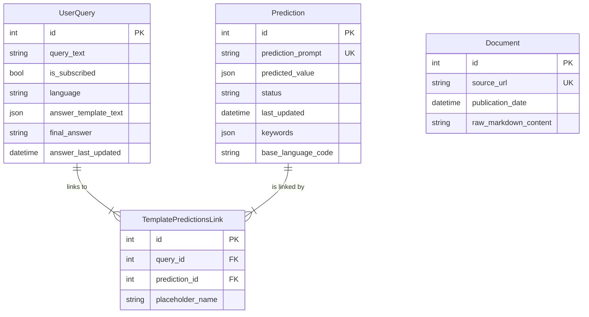
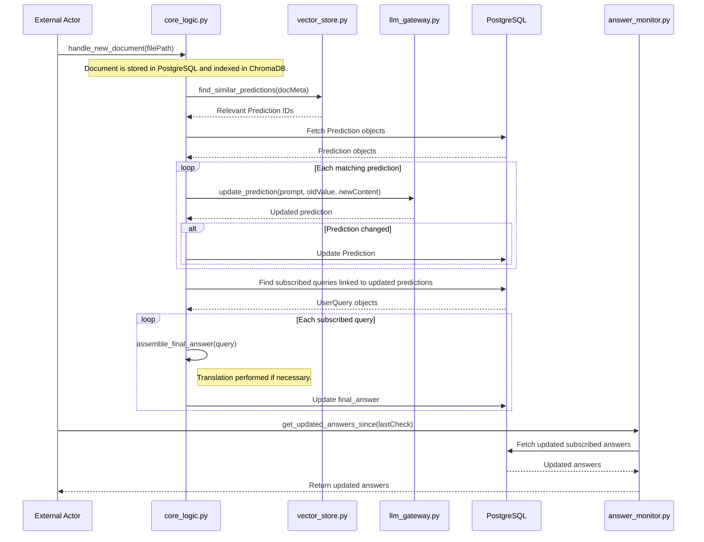

## Proactive

### 1. Core Philosophy

Traditional Retrieval-Augmented Generation (RAG) systems are inherently static. When the underlying knowledge base is updated, previously generated answers often become outdated. **Proactive RAG** addresses this limitation by continuously keeping answers synchronized with new information.

Whenever a new document is added to the system:

1. The document's semantic metadata is compared against all active **`Prediction`** tasks.
2. If a meaningful semantic match is found, the corresponding `Prediction` is re-executed using the newly available information.
3. Every **subscribed** user query that depends on this `Prediction` is automatically regenerated, ensuring its final answer reflects the latest knowledge.

This architecture enables the system to continuously improve itself while maintaining up-to-date responses without requiring users to resubmit their queries.

---

### 2. Cost Optimization Through Intelligent Prediction Reuse

One of the system's key innovations is minimizing inference cost and latency by intelligently reusing existing `Prediction` tasks.

**Workflow**

1. When a new user query arrives, the system generates its semantic embedding.
2. The embedding is used to search the `predictions` collection in ChromaDB for semantically similar existing prediction tasks.
3. The retrieved candidate predictions are provided to the primary LLM (e.g., GPT-4) together with the user's query.
4. Acting as a reasoning planner, the LLM decides whether:

   * an existing prediction can be reused, or
   * a completely new `Prediction` task should be created.
5. This proactive deduplication prevents semantically equivalent predictions from being repeatedly created and executed, significantly reducing both operational cost and response latency.

---

### 3. Document Processing Strategy

Instead of embedding entire documents, the system relies on **information-rich metadata** for retrieval and update detection.

* **Metadata-Based Vectorization**

  * When a document is ingested, its metadata—such as summaries and extracted keywords—is embedded and stored in ChromaDB.

* **Context Retrieval**

  * During prediction execution, the metadata vectors are searched to identify the most relevant documents, after which the **complete document contents** are supplied to the LLM as context.

This approach keeps the vector database lightweight while preserving access to complete source material during reasoning.

---

### 4. Database Architecture

The system employs two complementary databases:

* **PostgreSQL** for structured relational data.
* **ChromaDB** for semantic vector search.

#### PostgreSQL: Relational Storage

```mermaid
erDiagram
    UserQuery {
        int id PK
        string query_text
        bool is_subscribed
        string language
        json answer_template_text
        string final_answer
        datetime answer_last_updated
    }

    Prediction {
        int id PK
        string prediction_prompt UK
        json predicted_value
        string status
        datetime last_updated
        json keywords
        string base_language_code
    }

    TemplatePredictionsLink {
        int id PK
        int query_id FK
        int prediction_id FK
        string placeholder_name
    }

    Document {
        int id PK
        string source_url UK
        datetime publication_date
        string raw_markdown_content
    }

    UserQuery ||--|{ TemplatePredictionsLink : "links to"
    Prediction ||--|{ TemplatePredictionsLink : "is linked by"
```

#### ChromaDB: Vector Storage

* **`documents` collection**

  * Stores embeddings generated from document metadata (summaries, keywords, etc.).

* **`predictions` collection**

  * Stores embeddings of prediction prompts and their semantic keywords for efficient prediction reuse.

---

### 5. Prediction Lifecycle

Each `Prediction` object is managed through a lifecycle defined by its `status`.

* **`FULFILLED`**

  * The prediction has been executed successfully, contains a valid result, and is available for both reuse and future reactive updates.

* **`PENDING`**

  * The prediction has been created but has not yet been executed.

* **`INACTIVE`**

  * The prediction is no longer referenced by any active user query.

---

### 6. Query Subscription Model & Proactive Notifications 🔔

The subscription model is the foundation of the system's proactive update mechanism.

* Every `UserQuery` includes an `is_subscribed` flag, which defaults to **True**.
* Whenever a prediction changes, the system regenerates answers **only for subscribed queries**.
* Users (or applications) can unsubscribe from future automatic updates using the `update_user_query_subscription` function.
* The `src/answer_monitor.py` module integrates directly with this workflow. External services can periodically call `get_updated_answers_since()` to retrieve all subscribed answers updated after a given timestamp.

#### Subscription Workflow

The following sequence diagram illustrates how a subscribed query is automatically refreshed when a new document is added.

```mermaid
sequenceDiagram
    participant User as External Actor
    participant Core as core_logic.py
    participant VStore as vector_store.py
    participant LLM as llm_gateway.py
    participant DB as PostgreSQL
    participant Monitor as answer_monitor.py

    User->>Core: handle_new_document(filePath)

    Note over Core: Document is stored in PostgreSQL and indexed in ChromaDB.

    Core->>VStore: find_similar_predictions(docMeta)
    VStore-->>Core: Relevant Prediction IDs

    Core->>DB: Fetch Prediction objects
    DB-->>Core: Prediction objects

    loop Each matching prediction
        Core->>LLM: update_prediction(prompt, oldValue, newContent)
        LLM-->>Core: Updated prediction

        alt Prediction changed
            Core->>DB: Update Prediction
        end
    end

    Core->>DB: Find subscribed queries linked to updated predictions
    DB-->>Core: UserQuery objects

    loop Each subscribed query
        Core->>Core: assemble_final_answer(query)
        Note right of Core: Translation performed if necessary.
        Core->>DB: Update final_answer
    end

    User->>Monitor: get_updated_answers_since(lastCheck)

    Monitor->>DB: Fetch updated subscribed answers
    DB-->>Monitor: Updated answers
    Monitor-->>User: Return updated answers
```

---

### 7. Supported Query Types

#### Factual Queries

Extract factual information directly or indirectly contained within the document collection.

**Direct Information Retrieval**

Example:

> "Which law introduced Transfer of Development Rights?"

**List Generation**

Example:

> "Who is eligible for Transfer of Development Rights under the new legislation?"

**Definition**

Example:

> "What does 'valuation assessment' mean according to the Expropriation Law?"

**Summarization**

Example:

> "Summarize the latest document on urban transformation."

---

#### Inferential Queries

Require reasoning across multiple documents or combining multiple pieces of evidence.

**Comparative Analysis**

Example:

> "What are the major differences between expropriation procedures before and after 2019?"

**Cause-and-Effect Analysis**

Example:

> "How has including urban transformation within Transfer of Development Rights affected approval timelines?"

**Multi-Hop Reasoning**

Example:

> "What qualifications do the valuation firms mentioned in the latest Ministry regulation possess?"

---

#### Temporal Analysis Queries

Leverage Proactive RAG to analyze changes over time as new documents become available.

**Evolution Analysis**

Example:

> "How has the concept of Transfer of Development Rights evolved from its introduction in 2024 to the urban transformation amendments in 2025?"

**Historical Comparison**

Example:

> "How did citizens' legal rights regarding development rights change between December 2024 and July 2025?"

---

#### Procedural Queries

Explain processes and workflows step by step.

**Step-by-Step Guides**

Example:

> "What are the application steps for Transfer of Development Rights?"

**Roles and Responsibilities**

Example:

> "What are the responsibilities of independent valuation firms during the property valuation process?"

---

### 8. End-to-End Simulation (`run_full_test.py`)

The test script demonstrates the complete lifecycle of the system:

1. Environment reset
2. Document ingestion
3. Initial query execution
4. Reactive update triggered by newly added documents
5. Automatic regeneration and verification of subscribed answers

The simulation verifies that subscribed queries are proactively refreshed whenever new relevant information enters the knowledge base.
